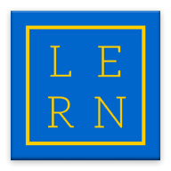

# Lern

## Tech Stack:
- [Meteor 1.6](https://guide.meteor.com/index.html)
- Model
  - MongoDB
  - [Astronomy](https://jagi.github.io/meteor-astronomy/v2)
- Render
  - [React](https://facebook.github.io/react/)
  - [React Mounter](https://github.com/kadirahq/react-mounter)
- Routes
  - [FlowRouter](https://github.com/kadirahq/flow-router)
- Styles
  - Sass
  - [Semantic UI React](https://react.semantic-ui.com/introduction)
  - [MaterialUI](http://www.material-ui.com)
  - [DraftJS](https://facebook.github.io/draft-js/) - [Examples](http://draftjs-examples.herokuapp.com/)
- Misc
  - [Lodash](https://lodash.com/)
  - [Moment](https://momentjs.com/)
- Tests
  - [Chai](http://chaijs.com/)

## Languages
- ES6 Javascript (.js)
- React Javascript (.jsx)
 
_Styleguides: [Airbnb](https://github.com/airbnb/javascript)_
 
_Linter: JSCS_

### Recomended editor: [Atom](https://atom.io/)
- Packages:
  - language-babel
  - linter
  - linter-jscs

## System Views
- Admin
- School
- Teacher
- Student

## Convention Highlights
- Global names should be PascalCased
- Imported and exported variables should be PascalCased
- Instance and variables should be camelCased
- Logic should be divided by the four sytem views
- Only top level view should fetch data
- Route name should match top level component name
- File name should match component name
